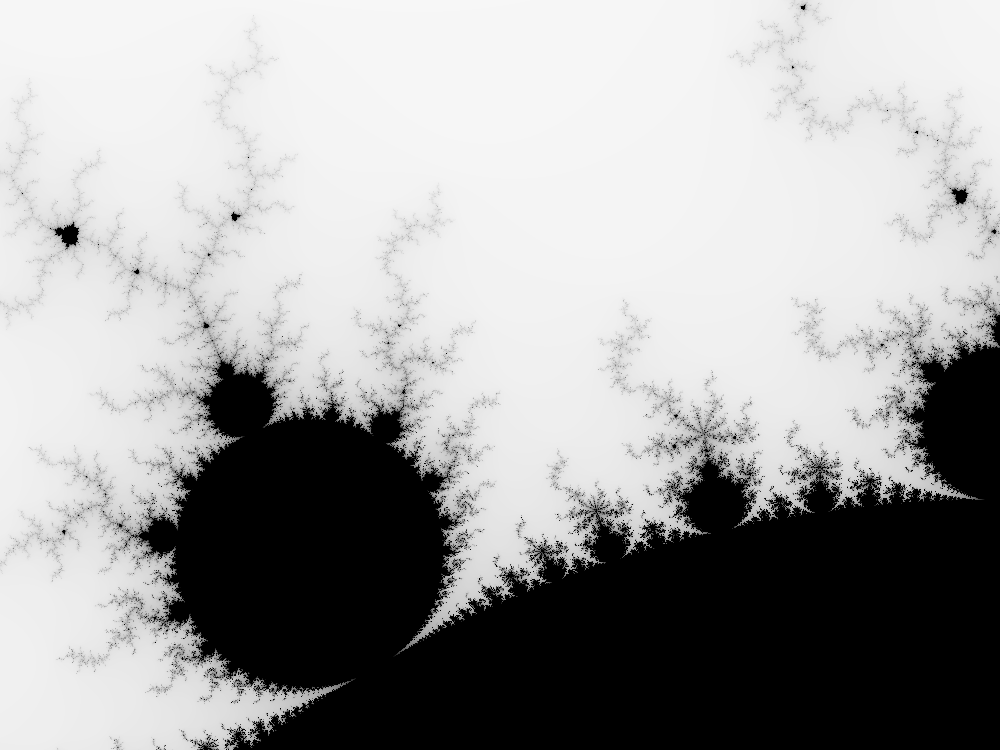

# Mandelbrot

^ this image is around 38MB, open it in a separate tab to zoom.

## Running the application

`cargo run -- --help` for a description of the arguments the program takes.

To generate the image in the example:  
`cargo run --release`

To generate an image with another complex space coordinates:  
`cargo run --release -- --bottom-right -0.8,0.2 --top-left -1,0.3`

To generate a _very_ large image:  
`cargo run --release -- --width 200000`
